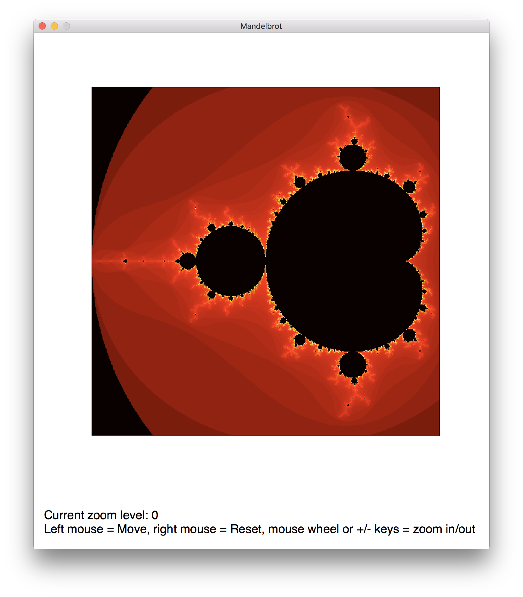

# Mandelbrot

numba.jit-powered Mandelbrot visualization. Zooming in/out and navigating around possible.

## Copyright

2017-2023 Denis Meyer

## Prerequisites

* Python 3

## Usage

* Create a virtual environment
  * `python -m venv venv`
* Activate the virtual environment
  * Mac/Linux
    * `source venv/bin/activate`
  * Windows
    * `.\venv\scripts\activate`
* Install the required libraries
  * `pip install -r requirements.txt`
* Run the app
  * `python src/Main.py`
